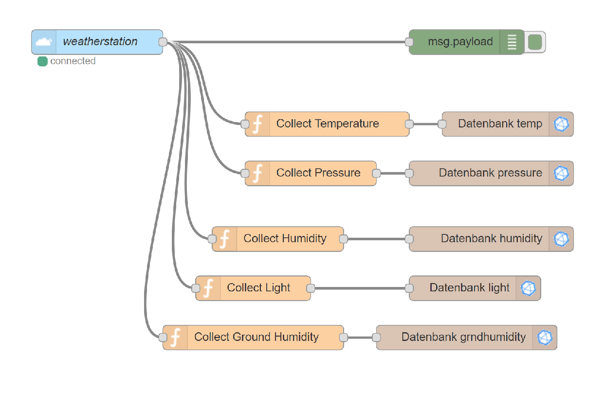

# Node-RED Installation und Konfiguration (Ubuntu/Debian)
## Installation
### Step 1: Node.js herunterladen und installieren
```bash
curl -sL https://deb.nodesource.com/setup_9.x | sudo -E bash -

sudo apt-get install -y nodejs
```

### Step 2: Installieren
```bash
sudo npm install -g --unsafe-perm node-red
```

### Step 3: Server starten
```bash
node-red
```

##### Optional in Screen starten
```bash
screen -d -m node-red
```
## Konfiguration

### TTN-Node anlegen


-TTN Erweiterung für Node-Red installieren
```bash
cd $home /.node-red
npm install node-red-contrib-ttn
```
- AppID (Name von Application)
- Region (eu, us, etc.)
- Access Key (In TTN Console zu finden)
### JavaScript Funktionen

- Beispiel zu Temperatur
  * Daten mit Bitshift zurück in 16bit Zahl
  * Umrechnung
```
var message = {};
var temp16;
temp16 = (msg.payload[0] << 8) | msg.payload[1];
temp16 = (temp16 / 100) - 50;
message.payload = temp16;
return message;
```
### Influx Output Nodes

- Datenbank hinterlegen
- Ausgabe in jeweiliges InfluxDB Measurement (Name eines Wertes) -> pressure, temp, humidity


